# IDaaS java akless alibabacloud adapter sdk
IDaaS has launched the AKless solution, enabling users to securely obtain temporary credentials for Alibaba Cloud RAM role without using Access Keys.

## Requirements
### 1. Create Account
Account > Accounts and Orgs, Create an account for SSO login in the development environment.


### 2. Create Cloud Account and Cloud Role
Delegate the target Alibaba Cloud account (AliUid) and its RAM role to IDaaS, configure a trust policy in RAM Console to authorize the specified IDaaS instance(as an OIDC identity provider) to request temporary security credentials on its behalf.

#### 2.1 Create Cloud Account
Cloud Identity > add Alibaba Cloud Acount, delegate the target Alibaba Cloud account (AliUid) to IDaaS.


Choose the method to add a cloud account based on your needs:
1. Add the current account: Users need to grant IDaaS the required permissions. After authorization, the system will automatically create an OIDC identity provider in the RAM Console when creating  cloud account, significantly simplifying the configuration process.<br>
2. Add another account: Enter the Alibaba Cloud account ID (AliUid) of the target RAM role, then manually create an OIDC identity provider in the RAM Console following the instructions.
   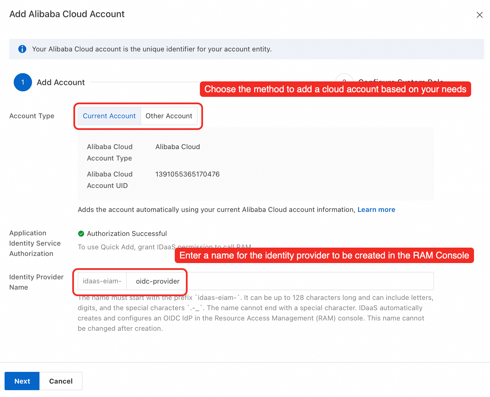

#### 2.2 Create System Role
Follow the instructions to create a system role in the RAM Console.（⚠️ If you're adding another account, you must also create an identity provider as guided）
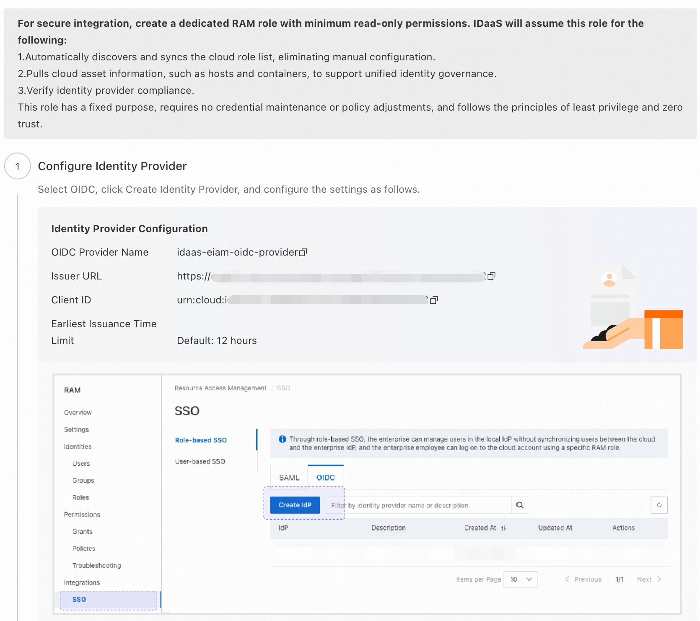
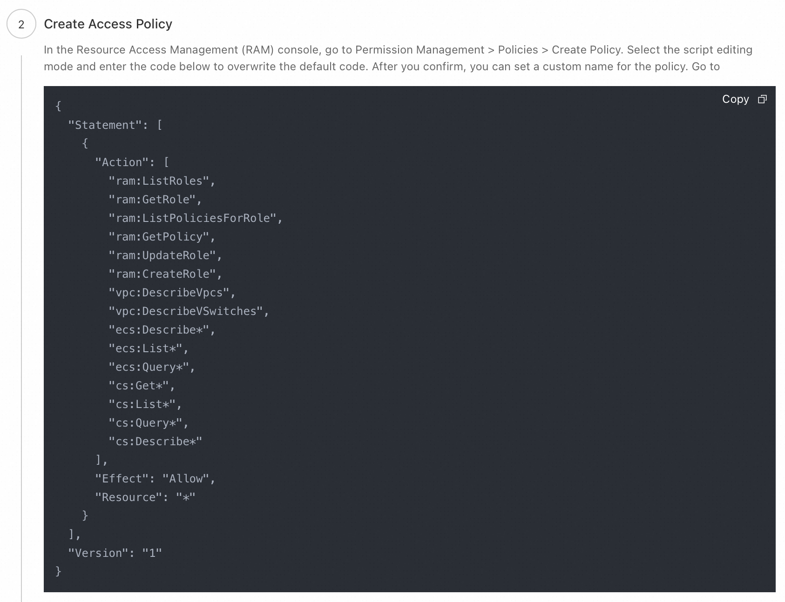
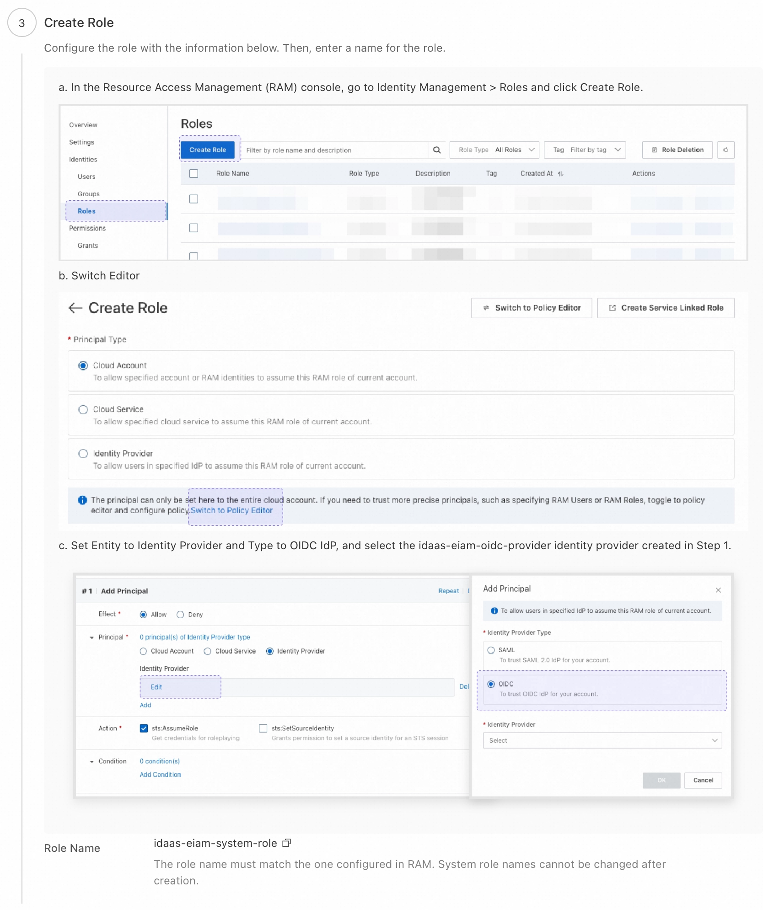
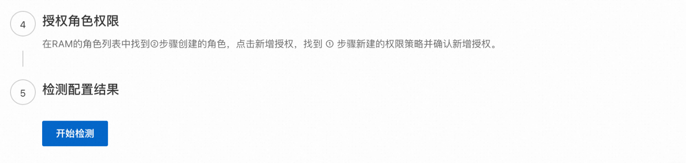

After completing the configuration in the RAM Console, return to the IDaaS and click the Start Check button to verify whether the system role is configured correctly.

#### 2.3 Create Cloud Role
Prerequisite: The system role must be available. Otherwise, you will be redirected to the system role configuration guide page.<br>
In the cloud role management list, click Add Cloud Role.
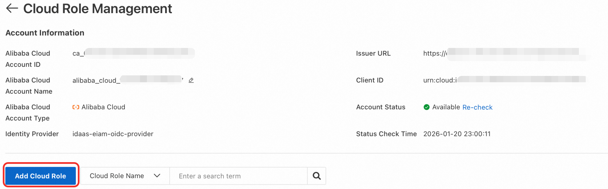
Select the cloud role to be delegated from the dropdown menu and follow the configuration guide to modify its trust policy in the RAM Console.(Afterward, you can use the SDK to obtain temporary credentials for this cloud role.)

After completing the configuration in the RAM Console, return to IDaaS to check the cloud role's status and verify whether the current cloud role is configured correctly.

### 3. Create M2M Client Application
Create an M2M client application in IDaaS to initiate authentication requests to the PAM (Privileged Access Management) application on behalf of the service.

#### 3.1 Development Environment
Application Management > Add Application > Chose M2M Application. Create an M2M client application in IDaaS instance to initiate authentication requests to the PAM (Privileged Access Management) application on behalf of the service.
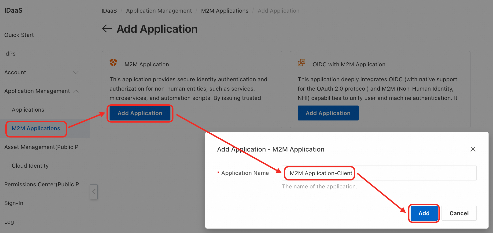

View Authorizations > Enable Custom Permissions. Enable client permission for the M2M application
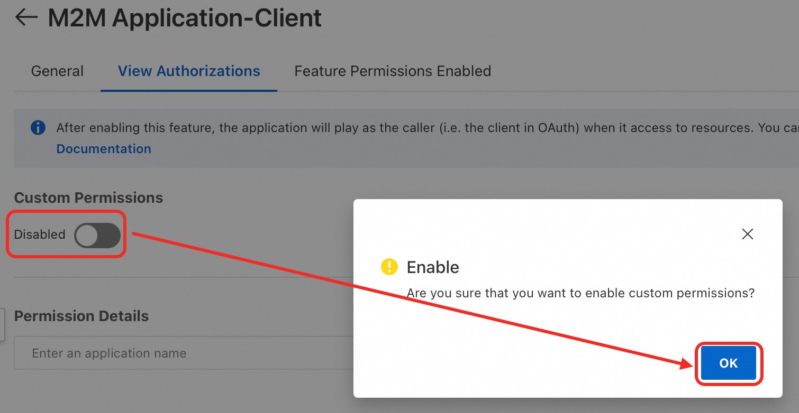

IDaaS will automatically create an OIDC with M2M system application named "Developer" and grant access permissions to all accounts under the root organization for this Developer application. The SDK obtains an Access Token for the Developer application based device flow. Developers need use a previously created account to complete authentication and authorization. By creating OIDC credentials for M2M client applications, the SDK can use this Access Token as credentials for M2M client applications to complete identity authentication with IDaaS and obtain a JWT-compliant Access Token，which can further be used to initiate an authentication request to the PAM (Privileged Access Management) application.  
In this Access Token, the "sub" claim corresponds to the account ID, and the "aud" claim corresponds to the audience identifier of the Developer application, "urn:cloud:idaas:developer," which needs to be configured accordingly.    
Sign-In > Authentication Configuration > Federated Credential Provider Management > Add Federated Credential Provider > Chose OIDC Federated Credential
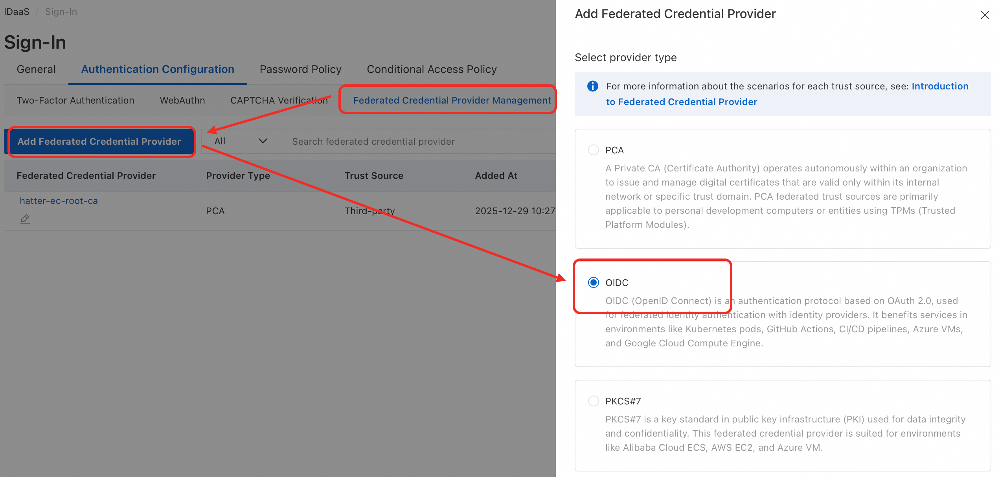

Fill in the Issuer. The ResourceServer identifier must correspond to the "aud" claim in the Access Token for the Developer application. Fill in "urn:cloud:idaas:developer".
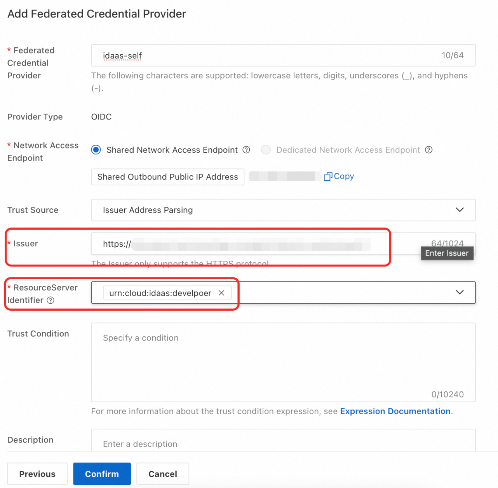

General > Credential Management > Create OIDC Federated Credential
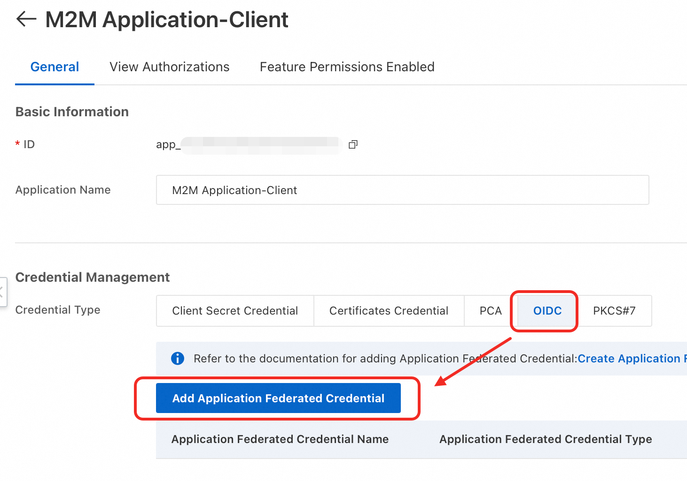

Select the Federated Credential Provider created in the previous step, choose the Expression Verification for Claims Field for the verification, and ensure that the subject identifier corresponds to the "sub" claim in the Access Token for the Developer application. Fill in the account ID of account  created in the previous step.
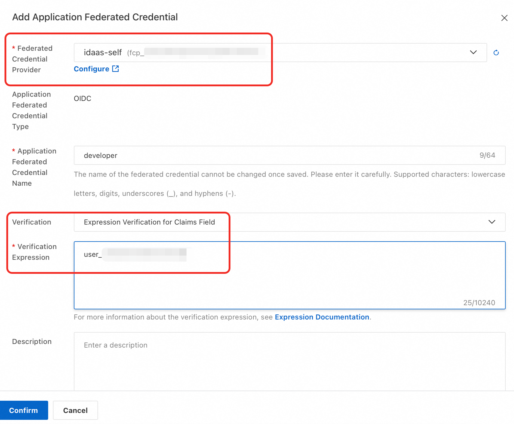

#### 3.2 Production Environment
Application Management > Add Application > Chose M2M Application. Create an M2M client application in IDaaS instance to initiate authentication requests to the PAM (Privileged Access Management) application on behalf of the service.


View Authorizations > Enable Custom Permissions. Enable client permission for the M2M application


General > Credential Management > Create Credential. Support Client Secret credential, Certificates Credential, OIDC and PKCS#7 federated credential.     
Federal credential creation guidelines can be found at: https://help.aliyun.com/zh/idaas/eiam/user-guide/create-application-federated-credential?spm=5176.2020520154.console-base_help.dexternal.72a0oO7PoO7Pok
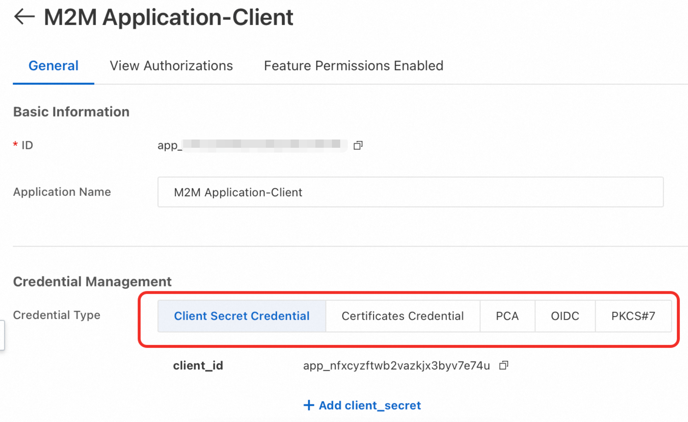

### 4. Authorize the M2M Client Application
The M2M client application need complete feature permission and data permission to obtain temporary credentials for RAM role via the PAM application.

#### 4.1 Feature Permission
Grant the M2M client application the permission to obtain temporary credentials for cloud roles via the PAM application.    
Permissions Center > Feature Permission Management > Chose Privileged Access Management Application
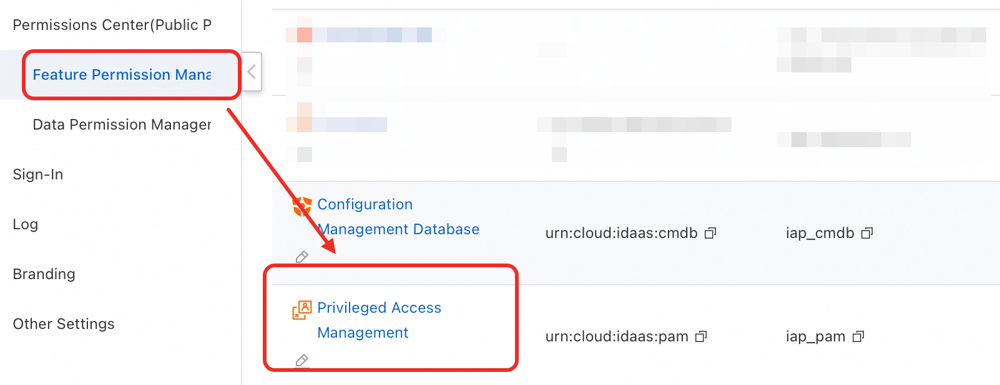

Authorization Management > Authorize > Select the M2M client application created in the previous step and grant it the permission to obtain access credentials for cloud roles.
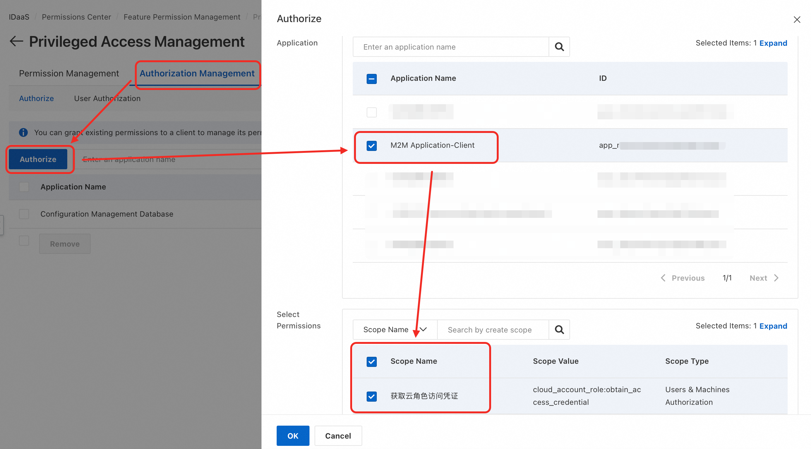

#### 4.2 Data Permission
Grant the M2M client application permission to assume the specified cloud role.     
Permissions Center > Data Permission Management > Add Data Authorization Rule
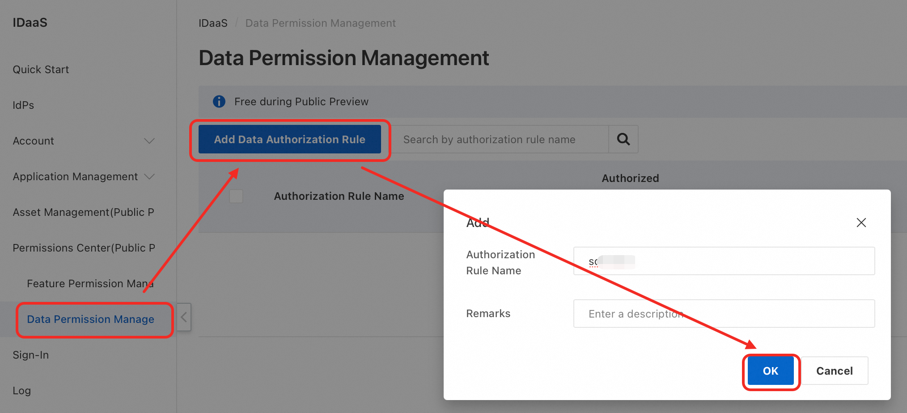

Navigate to the newly created authorization rule，select the M2M client application created in the previous step to finalize the authorization.
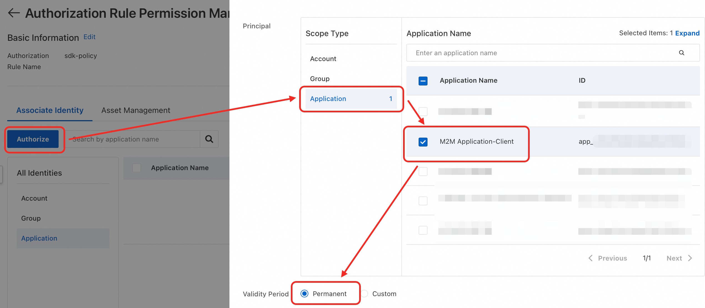

Asset Management > Add Assert，Select the cloud role that requires authorization, allowing the Associated identity (the M2M client application authorized in the previous step) to access resources via temporary credentials.
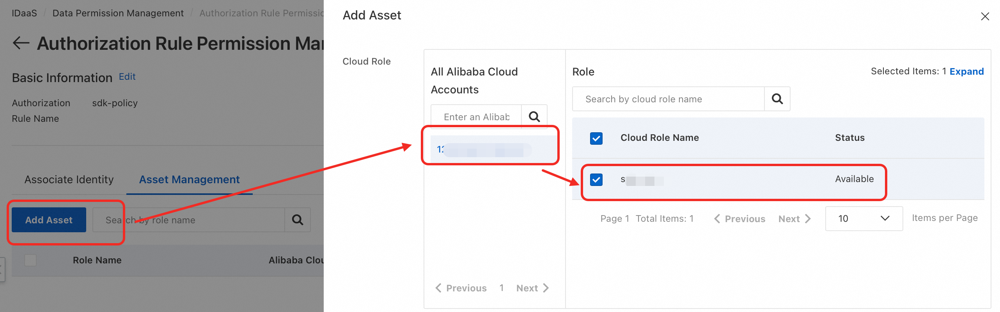

## Integration
Import Dependencies
```yaml
<dependency>
    <groupId>com.cloud_idaas</groupId>
    <artifactId>idaas-java-core-sdk</artifactId>
    <version>0.0.1-beta</version>
</dependency>
<dependency>
    <groupId>com.cloud_idaas</groupId>
    <artifactId>idaas-java-akless-alibabacloud-adapter</artifactId>
    <version>0.0.1-beta</version>
</dependency>
```
### 1. Development Environment
IDaaS creates an OIDC with M2M System Application (Developer) automatically，which enables SSO login for personnel in the development environment.The SDK first obtains an Access Token for accessing the Developer application through device flow, and developers need to complete authentication and authorization using a previously created account. By creating OIDC credentials for M2M client applications, the SDK can use this Access Token as credentials for M2M client applications to complete identity authentication with IDaaS and obtain a JWT-compliant Access Token, which can further request Alibaba Cloud RAM secure token service via the Akless solution. IDaaS configuration needs to be specified through configuration files.     
Default path for configuration file: User home directory/.cloud_idaas/client-config.json     
The configuration file can also be specified through JVM parameters or environment variables:
1. JVM parameter name: cloud_idaas_config_path
2. Environment variable name: CLOUD_IDAAS_CONFIG_PATH
```yaml
{
    "idaasInstanceId": ,                # IDaaS instance ID
    "clientId": ,                       # Client application client_id
    "issuer": ,                         # IDaaS issuer endpoint
    "tokenEndpoint": ,                  # IDaaS token endpoint
    "deviceAuthorizationEndpoint": ,    # IDaaS device authorization endpoint
    "scope": "urn:cloud:idaas:pam|cloud_account_role:obtain_access_credential",    # Fixed value
    "pamResourceServerEndpoint": "eiam-developerapi.cn-hangzhou.aliyuncs.com",     # Fixed value
    "authnConfiguration": {
        "identityType": "HUMAN",                  # Fixed as HUMAN, indicating development environment
        "authnMethod": "OIDC",                    # Authentication method for client application, using OIDC federated credentials
        "applicationFederatedCredentialName":     # OIDC federated credential name for client application
        "clientDeployEnvironment": "COMPUTER",    # Deployment environment, COMPUTER indicates development computer
    }
}
```

### 2. Production Environment
IDaaS SDK authenticates with IDaaS through the M2M client application and obtains an Access Token compliant with the JWT standard. Furthermore, it can request Alibaba Cloud RAM secure token service via the Akless solution. IDaaS configuration needs to be specified through configuration files.      
Default path for configuration file: User home directory/.cloud_idaas/client-config.json           
The configuration file can also be specified through JVM parameters or environment variables:
1. JVM parameter name: cloud_idaas_config_path
2. Environment variable name: CLOUD_IDAAS_CONFIG_PATH
```yaml
{
    "idaasInstanceId": ,            # IDaaS instance ID
    "clientId": ,                   # Client application client_id
    "issuer": ,                     # IDaaS issuer endpoint
    "tokenEndpoint": ,              # IDaaS token endpoint
    "scope": "urn:cloud:idaas:pam|cloud_account_role:obtain_access_credential",    # Fixed value
    "pamResourceServerEndpoint": "eiam-developerapi.cn-hangzhou.aliyuncs.com",     # Fixed value
    "authnConfiguration": {
        "identityType": "CLIENT",   # Fixed as CLIENT, indicating production environment
        "authnMethod": ,            # Authentication method for client application, supports: CLIENT_SECRET_POST, CLIENT_SECRET_JWT, PRIVATE_KEY_JWT, PKCS7, OIDC
    }
}
```
According to different authnMethod, the required authentication configurations are shown in the following table

| authnMethod         | Field names in authnConfiguration | Remark                                                                                                                                                                                                                                               | 
|---------------------|---------------------------------|------------------------------------------------------------------------------------------------------------------------------------------------------------------------------------------------------------------------------------------------------|
| CLIENT_SECRET_BASIC<br/>CLIENT_SECRET_POST<br/>CLIENT_SECRET_JWT | clientSecretEnvVarName   | client_secret is specified through environment variable, the environment variable name is the same as the value of clientSecretEnvVarName                                                                                                            |
| PRIVATE_KEY_JWT     | privateKeyEnvVarName     | privateKey is specified through environment variable, the environment variable name is the same as the value of privateKeyEnvVarName                                                                                                                 |
| PKCS7               | applicationFederatedCredentialName | PKCS7 federated credential name                                                                                                                                                                                                                      |
|                     | clientDeployEnvironment       | Deployment environment, supports ALIBABA_CLOUD_ECS                                                                                                                                                                                                   |
| OIDC                | applicationFederatedCredentialName | OIDC federated credential name                                                                                                                                                                                                                       |
|                     | clientDeployEnvironment | Deployment environment, supports KUBERNETES and COMPUTER                                                                                                                                                                                             |
|                     | oidcTokenFilePath | Can be specified when deployment environment is KUBERNETES, oidcTokenFilePath is the path to save OIDC Token file.                                                                                                                                   |
|                     | oidcTokenFilePathEnvVarName | When oidcTokenFilePath is not specified, oidcTokenFilePathEnvVarName takes effect. The path to save OIDC Token file is specified through environment variable, the environment variable name is the same as the value of oidcTokenFilePathEnvVarName |

## Sample

The following modifications are needed in the code:
1. Specify the ARN of the delegated Alibaba Cloud RAM role
2. Read the configuration file to complete the initialization of IDaaS configuration.
3. Initialize credential client
    1. Obtain IDaaS credentialProvider
    2. Pass credentialProvider to the client


Complete code sample can be found at: https://github.com/cloud-idaas/akless-sample